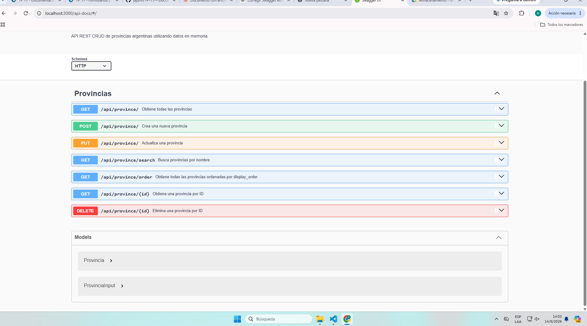
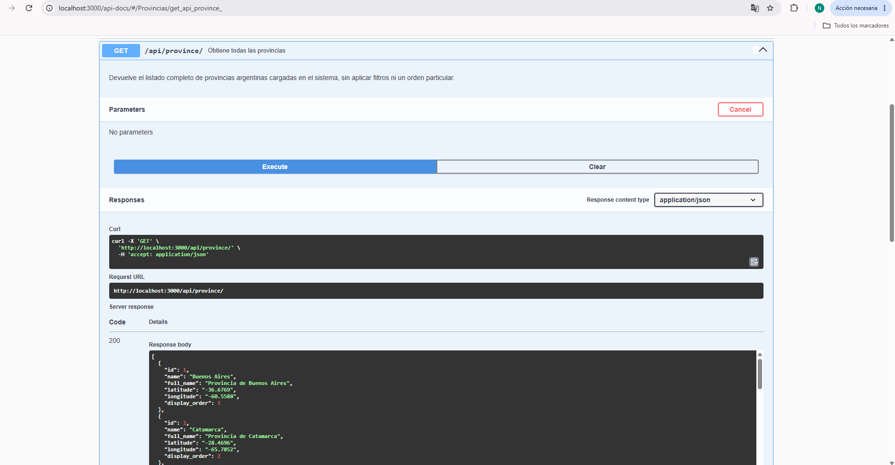
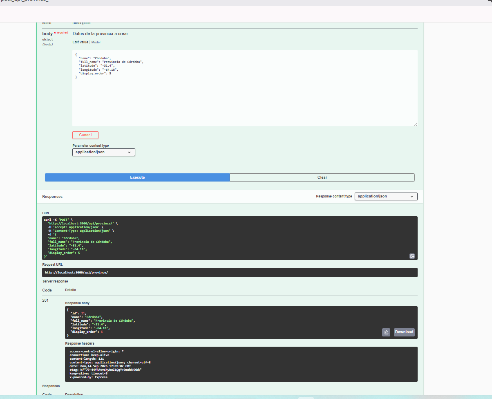
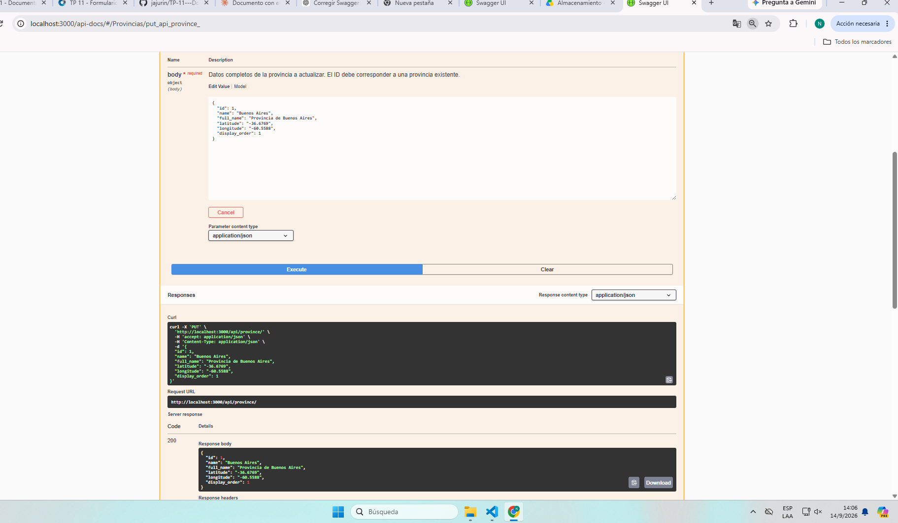
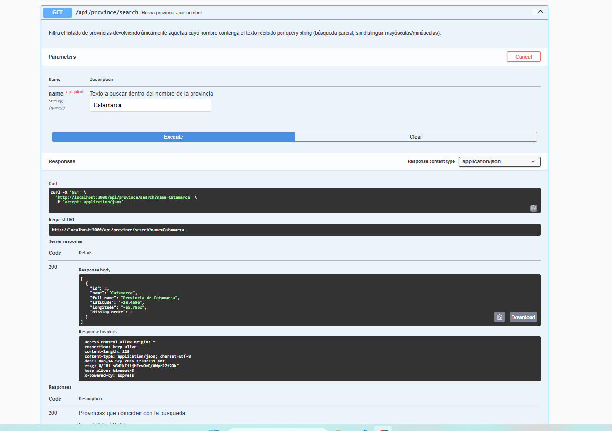
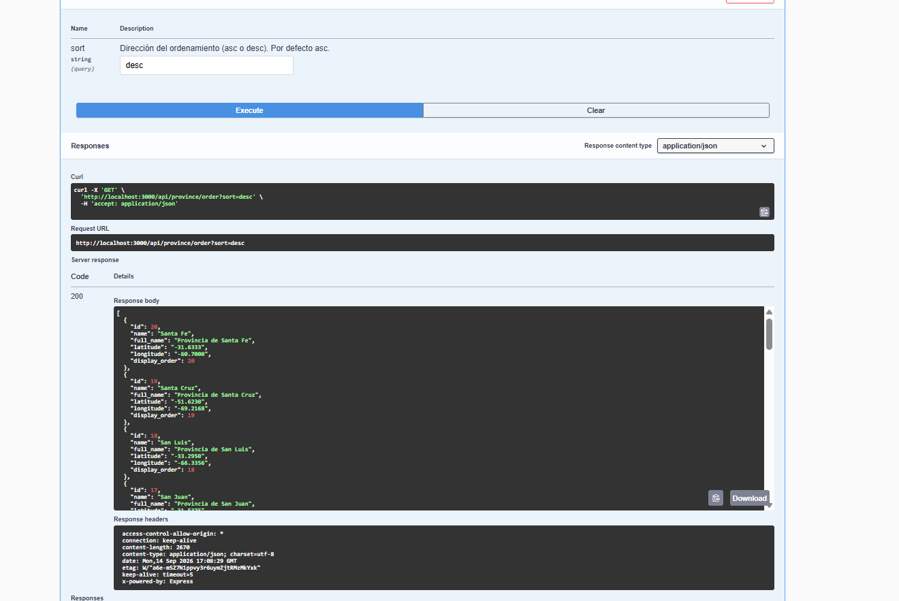
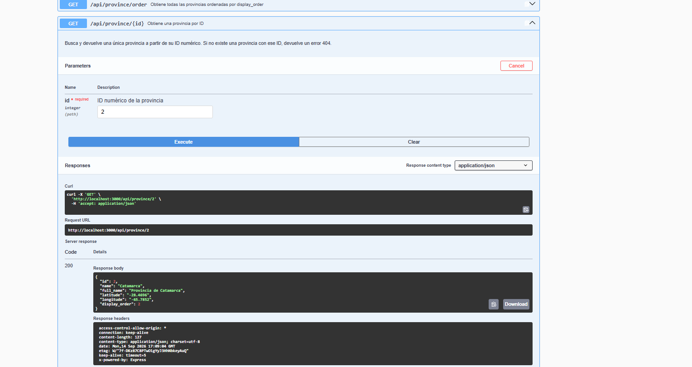

# Documentación de API con Swagger — Provincias Argentinas

## 1. Descripción del proyecto

**TP-08 - PG Provincias** es una API REST desarrollada en **Node.js + Express** que permite gestionar un ABM (alta, baja, modificación y consulta) de las 20 provincias argentinas. Los datos se manejan actualmente **en memoria** (`src/data/provinces.js`)

Es una **API propia**, desarrollada íntegramente por el grupo, con arquitectura en capas:

- **Controller** → rutas y validación de entrada HTTP
- **Service** → reglas de negocio y validaciones de dominio
- **Repository** → acceso a los datos

**URL base:** `http://localhost:3000`

## 2. Por qué esta API

- Tiene 7 endpoints (supera el mínimo de 6 pedido).
- CRUD completo (GET, POST, PUT, DELETE) + 2 endpoints de consulta extra (búsqueda por nombre, orden por `display_order`).
- Validaciones de negocio bien definidas que disparan distintos códigos de error (400, 404, 500), ideal para documentar respuestas.

## 3. Endpoints

| Método | Endpoint                         | Descripción                                                                 |
|--------|-----------------------------------|------------------------------------------------------------------------------|
| GET    | `/api/province/`                  | Obtiene el listado completo de provincias.                                  |
| GET    | `/api/province/search?name=`      | Busca provincias cuyo nombre contenga el texto recibido (búsqueda parcial). |
| GET    | `/api/province/order?sort=asc\|desc` | Devuelve todas las provincias ordenadas por `display_order` (asc por defecto). |
| GET    | `/api/province/:id`               | Obtiene una provincia puntual por ID.                                       |
| POST   | `/api/province/`                  | Crea una nueva provincia (ID autogenerado, valida campos obligatorios).     |
| PUT    | `/api/province/`                  | Actualiza una provincia existente (el `id` del body debe existir).          |
| DELETE | `/api/province/:id`               | Elimina una provincia por ID.                                               |

## 4. Modelo `Provincia`

| Propiedad       | Tipo   | Descripción                                                                 |
|------------------|--------|------------------------------------------------------------------------------|
| `id`             | number | Generado automáticamente por el sistema (no se envía en el alta).           |
| `name`           | string | Nombre corto. Mínimo 3 caracteres.                                          |
| `full_name`      | string | Nombre oficial completo. Mínimo 5 caracteres.                               |
| `latitude`       | string | Latitud del centro de la provincia (texto, debe representar un número).     |
| `longitude`      | string | Longitud del centro de la provincia (texto, debe representar un número).    |
| `display_order`  | number | Orden opcional para listados.                                               |

```json
{
  "id": 1,
  "name": "Buenos Aires",
  "full_name": "Provincia de Buenos Aires",
  "latitude": "-36.6769",
  "longitude": "-60.5588",
  "display_order": 1
}
```

## 5. Cómo levantar la documentación

```bash
npm install
node swagger.js   # regenera swagger_output.json y luego levanta el servidor
```

Documentación interactiva disponible en:

**http://localhost:3000/api-docs**

## 6. Cómo está implementado Swagger

- `swagger-autogen` genera la especificación (`swagger_output.json`) a partir de comentarios `#swagger.*` puestos en cada ruta de `src/controllers/province-controller.js`.
- `swagger.js` define la config base del doc (título, descripción, versión, host, schemes) y los modelos reutilizables `Provincia` / `ProvinciaInput` en `@definitions`, referenciados con `$ref` en cada endpoint.
- `index.js` importa el JSON generado y monta la UI con:
  ```js
  app.use("/api-docs", swaggerUi.serve, swaggerUi.setup(swaggerFile));
  ```

## 7. Códigos de respuesta

| Código | Significado           | Cuándo se produce                                                                 |
|--------|------------------------|-------------------------------------------------------------------------------------|
| 200    | OK                     | Consulta resuelta correctamente (todos los GET).                                   |
| 201    | Created                | Provincia creada correctamente (`POST /api/province/`).                            |
| 400    | Bad Request            | ID no numérico, parámetro `name`/`sort` inválido o faltante, campos obligatorios inválidos. |
| 404    | Not Found              | Provincia inexistente por ID, búsqueda sin resultados, update sobre ID inexistente. |
| 500    | Internal Server Error  | Error inesperado, capturado por el try/catch de cada endpoint.                     |

## 8. Pruebas realizadas desde Swagger UI

- ✅ GET: listado completo y consulta por ID.
- ✅ POST / PUT: creación y actualización enviando body en JSON.
- ✅ Endpoint con parámetros: búsqueda por nombre y listado ordenado (query params).
- ✅ DELETE: eliminación por ID.

## 9. Evidencia

## 9. Evidencia

### GET /api/province/



### POST /api/province/



### PUT /api/province/



### GET /api/province/search?name=



### GET /api/province/order?sort=asc|desc



### GET /api/province/:id



### DELETE /api/province/:id




## 10. Problemas encontrados y cómo fueron solucionados
Los modelos no se generaban como esquemas reutilizables. Al principio definimos los modelos en swagger.js como una clave normal definitions dentro del objeto doc, y swagger-autogen los interpretaba como un simple ejemplo fijo (mostraba todo el JSON de ejemplo pero no generaba los campos editables del formulario en Swagger UI). Se solucionó cambiando la clave a @definitions, que es la que swagger-autogen reconoce específicamente para registrar esquemas reutilizables y referenciarlos con $ref en cada endpoint.

swagger_output.json no se generaba ni se actualizaba. Al principio, swagger.js no estaba llamando correctamente a swaggerAutogen (faltaba la dependencia instalada / la importación estaba mal hecha), por lo que al ejecutar el script no se creaba el archivo swagger_output.json, y si ya existía uno viejo, tampoco se actualizaba con los nuevos comentarios #swagger.* agregados en el controlador. Se solucionó instalando bien la dependencia swagger-autogen y verificando que swagger.js llame correctamente a swaggerAutogen(outputFile, endpointsFiles, doc) antes de levantar el servidor.

Error al correr node index.js directamente. Como index.js importa el archivo generado con import swaggerFile from "./swagger_output.json" with { type: "json" }, si se intentaba levantar el servidor con node index.js (o npm start) antes de haber ejecutado swagger.js al menos una vez, swagger_output.json no existía todavía y el servidor tiraba un error de módulo no encontrado al arrancar. Se solucionó dejando en claro que el flujo correcto es siempre ejecutar primero node swagger.js (que genera el archivo y recién después levanta index.js), y no node index.js de forma aislada.
